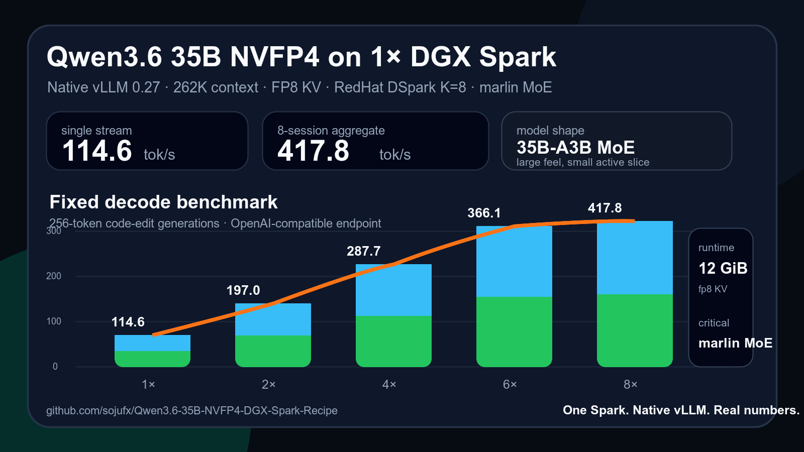

# Qwen3.6 35B NVFP4 on 1x DGX Spark

A native vLLM `0.26` recipe for running `unsloth/Qwen3.6-35B-A3B-NVFP4` on a single NVIDIA DGX Spark / GB10 with 262K context, FP8 KV cache, DFlash speculative decoding, tool/reasoning parser support, and strong multi-session throughput.

> Native vLLM. One Spark. 262K context. 338 tok/s aggregate.



## Why this setup matters

Qwen3.6 35B-A3B NVFP4 is a strong fit for Spark because it is MoE: the model is large, but only a smaller active slice runs per token. With FP8 KV cache and DFlash speculative decoding, it can deliver both long context and serious aggregate throughput on one 128GB unified-memory box.

This recipe is focused on the native vLLM path:

- no custom container required
- existing venv/systemd production style
- cached local model snapshots supported
- 262,144-token context
- DFlash K=7
- 338.4 tok/s aggregate at 8 sessions in my benchmark

The main value is reproducibility: this is not just a launch command, it includes the exact serve shape, autostart template, smoke test, and concurrency benchmark so other Spark owners can verify their own box instead of guessing.

## Tested profile

```text
Hardware: NVIDIA DGX Spark / GB10 / 128GB unified memory
Runtime: native vLLM 0.26.0 venv
Model: unsloth/Qwen3.6-35B-A3B-NVFP4
Draft: z-lab/Qwen3.6-35B-A3B-DFlash
Context: 262,144 tokens
KV cache: fp8
KV cache memory: 12 GiB pinned
Linear backend: auto
Attention backend: flashinfer
Spec decode: DFlash, K=7
Tool parser: qwen3_coder
Reasoning parser: qwen3
Vision: enabled, up to 4 images/request
```

## My native vLLM 0.26 benchmark

Measured on one DGX Spark using native vLLM `0.26.0`, `linear-backend auto`, FP8 KV, and `z-lab/Qwen3.6-35B-A3B-DFlash` at K=7.

| Load | Aggregate tok/s | Mean stream tok/s |
|---:|---:|---:|
| 1x | 73.4 | 73.4 |
| 2x | 147.4 | 74.2 |
| 3x | 190.6 | 64.2 |
| 4x | 238.0 | 61.2 |
| 6x | 327.0 | 57.9 |
| 8x | 338.4 | 43.8 |

Startup:

```text
GPU KV cache size: 647,182 tokens
Maximum concurrency for 262,144 tokens/request: 2.47x
Selected NVFP4 GEMM: CutlassNvFp4LinearKernel
```

Full notes: [`results/2026-07-30-native-vllm026-dflash-k7.md`](results/2026-07-30-native-vllm026-dflash-k7.md)

## Quickstart

```bash
git clone https://github.com/sojufx/Qwen3.6-35B-NVFP4-DGX-Spark-Recipe.git
cd Qwen3.6-35B-NVFP4-DGX-Spark-Recipe

export VLLM_API_KEY="change-me"

./scripts/start-qwen-native-vllm026.sh
```

OpenAI-compatible endpoint:

```text
http://127.0.0.1:8000/v1
```

## Main serve flags

```bash
--model unsloth/Qwen3.6-35B-A3B-NVFP4
--tensor-parallel-size 1
--trust-remote-code
--moe-backend auto
--linear-backend auto
--attention-backend flashinfer
--kv-cache-dtype fp8
--kv-cache-memory-bytes 12G
--max-model-len 262144
--max-num-seqs 24
--max-num-batched-tokens 32768
--enable-chunked-prefill
--enable-prefix-caching
--async-scheduling
--speculative-config '{"method":"dflash","model":"z-lab/Qwen3.6-35B-A3B-DFlash","num_speculative_tokens":7,"draft_tensor_parallel_size":1}'
--tool-call-parser qwen3_coder
--enable-auto-tool-choice
--reasoning-parser qwen3
```

## Important notes

- Use vLLM `0.26.0` or newer with GB10/SM121 support.
- Set `CUTE_DSL_ARCH=sm_121a`.
- Use FP8 KV for 256K context.
- This model can support image inputs when the runtime and client send multimodal chat messages correctly.
- The benchmark in this repo is a short code-shaped decode test with exact 500-token outputs.
- For long-context agent workloads, run your own benchmark before changing production.

## Credits

Built from our own DGX Spark experiments with:

- [Unsloth Qwen3.6 35B NVFP4 model](https://huggingface.co/unsloth/Qwen3.6-35B-A3B-NVFP4)
- [z-lab Qwen3.6 35B DFlash draft](https://huggingface.co/z-lab/Qwen3.6-35B-A3B-DFlash)
- [vLLM](https://github.com/vllm-project/vllm)
- [FlashInfer](https://github.com/flashinfer-ai/flashinfer)

## Files

- [`scripts/start-qwen-native-vllm026.sh`](scripts/start-qwen-native-vllm026.sh) — tested native vLLM launcher
- [`scripts/stop-qwen.sh`](scripts/stop-qwen.sh) — stop helper
- [`scripts/benchmark-qwen.py`](scripts/benchmark-qwen.py) — OpenAI-compatible benchmark
- [`systemd/qwen-vllm.service`](systemd/qwen-vllm.service) — optional autostart template
- [`docs/CONFIG.md`](docs/CONFIG.md) — flag notes
- [`docs/TROUBLESHOOTING.md`](docs/TROUBLESHOOTING.md) — common failures
- [`results/2026-07-30-native-vllm026-dflash-k7.md`](results/2026-07-30-native-vllm026-dflash-k7.md) — measured native vLLM result
